# Example from last lecture: Bayesian Analysis in Cancer Diagnosis

---

## Understanding False Positives, True Positives, and Test Accuracy

| Test Result | Cancer Present | Cancer Absent |
|-------------|----------------|----------------|
| **Positive** | True Positive  | False Positive |
| **Negative** | False Negative | True Negative  |

**Key Takeaway:**  
Always combine test results with prior probability for accurate interpretation.

---


| Term            | Definition                                                                 | Example                                  |
|-----------------|---------------------------------------------------------------------------|------------------------------------------|
| **True Positive (TP)** | Test correctly detects cancer                                              | Biopsy confirms positive screening       |
| **False Positive (FP)**| Test incorrectly flags cancer (no disease present)                         | Mammogram positive, but follow-up normal |
| **True Negative (TN)** | Test correctly rules out cancer                                            | Healthy result confirmed                 |
| **False Negative (FN)**| Test misses cancer (disease present but undetected)                        | Early-stage tumor not identified         |

---


## Example Scenario
Question: If someone tests positive, what’s the probability they actually have cancer?


---

## Bayes' Theorem Formula

```math
P(\text{Cancer} \mid \text{Test}^+) = \frac{P(\text{Test}^+ \mid \text{Cancer}) \cdot P(\text{Cancer})}{P(\text{Test}^+)}
```

**Components:**
- $P(\text{Cancer})$: Prevalence (prior probability)  
- $P(\text{Test}^+ \mid \text{Cancer})$: Sensitivity (True Positive Rate)  
- $P(\text{Test}^+)$: Total positive probability (TP + FP)  

---


**Given:**
- Prevalence = 1% ($P(\text{Cancer}) = 0.01$)  
- Sensitivity = 90% ($P(\text{Test}^+ \mid \text{Cancer}) = 0.9$)  
- False Positive Rate = 5% ($P(\text{Test}^+ \mid \text{No Cancer}) = 0.05$)  

---

**Calculation:**  
1. **True Positives**: $0.9 \times 0.01 = 0.009$  
2. **False Positives**: $0.05 \times 0.99 = 0.0495$  
3. **Posterior Probability**:  

```math
\frac{0.009}{0.009 + 0.0495} \approx 15.4\%
```

**Interpretation:**  
A positive test only implies a **15.4% chance** of actual cancer due to low prevalence and false alarms.

---

## Why This Matters

- **False Positives:** Unnecessary stress, invasive follow-ups  
- **False Negatives:** Delayed treatment  
- **Bayesian Insight:** Test accuracy depends heavily on disease prevalence.  

**Trade-off:**  
- High sensitivity (↓ False Negatives) often increases False Positives.  


----

# Relations

*The content of the slides is gathered from:*
- [https://www.cs.odu.edu/~toida/nerzic/level-a/web_course.html](https://www.cs.odu.edu/~toida/nerzic/level-a/web_course.html)
- [www.cs.yale.edu/homes/aspnes/classes/202/notes.pdf](www.cs.yale.edu/homes/aspnes/classes/202/notes.pdf)
- And the textbook.

---
### Relations
- The study of relations is the abstraction of relations in our daily life.
- The relational model is widely used in databases.

---

**Student**

| Name | Department | Class |
|------|------------|-------|
| A    | Math       | 1     |
| B    | CS         | 1     |

- Each row is an instance of a relation.
- The table (as a collection of rows) is the relation.
- Operations such as inserting/deleting entries, merging two tables, etc., can be described by operations on relations.

---

# Definitions

---

### Ordered pair (sirali cift)
- A set of objects with an order associated with them.
- For the objects $a$ and $b$, 
	- we write an ordered pair as $(a,b)$ or $(b,a)$. 
	- In general $(a,b)$ is different from $(b,a)$
	

---

### Equality of ordered pairs
 
- Ordered pairs $(a, b)$ and $(c, d)$ are equal if and only if $a = c$ and $b = d$. 

**Example:**
- if the ordered pair $(a, b)$ is equal to $(1, 2)$,   then $a = 1$, and $b = 2$.  
- $(1, 2)$ is not equal to the ordered pair $(2, 1)$.  

---

### Binary relation (ikili iliski)

- A **binary relation** from a set $A$ to a set $B$ is a set of ordered pairs $(a, b)$ where 
	- $a$ is an element of $A$ 
	- and $b$ is an element of $B$.

- When an ordered pair $(a, b)$ is in a relation $R$,
	- we write $a R b$, or $(a, b)\in R$.
	- the element $a$ is related to $b$ in $R$.
	
- When $A = B$,  a relation from $A$ to $B$ is a (binary) relation on $A$. 


---

### Cartesian Product: $A\times B$
- For $a\in A$ and $b\in B$; the set of all ordered pairs $(a, b)$ is called the Cartesian product of $A$ and $B$.

- A binary relation from $A$ to $B$ is a subset of Cartesian product $A\times B$.

---

**example**
If $A = \{1, 2, 3\}$ and $B = \{4, 5\}$,

- $\{(1, 4), (2, 5), (3, 5)\}$ is  a binary relation from $A$ to $B$.
- $\{(1, 1), (1, 4), (3, 5)\}$ is **NOT** a binary relation from $A$ to $B$.


---

### n-ary Relation
**ordered n-tuple**
- **An ordered n-tuple** is a set of $n$ objects with an order associated with them.
 - If $n$ objects are represented by $x_1, x_2, ..., x_n$, then we write the ordered n-tuple as $(x_1, x_2, ..., x_n)$


---

### Cartesian product

- The set of all ordered n-tuples $(x_1, x_2, ..., x_n)$, where $x_i\in A_i$ for all $i$, $1 \leq i \leq n$, is the Cartesian product of the sets $A_1, ..., A_n$ denoted by $A_1\times...\times A_n$.

---

### Equality of n-tuples
- Two ordered n-tuples $(x_1, x_2, ..., x_n)$ and $(y_1, y_2, ..., y_n)$ are equal if and only if $x_i=y_i$ for all $i$, $1 \leq i \leq n$.

---

### n-ary relation

- An n-ary relation on sets $A_1, ..., A_n$ is the subset of $A_1\times...\times A_n$.


---

# Equality of Relations

---

### Equality of Relations

- Two binary relation $R_1\subseteq A_1 \times A_2$ and $R_2\subseteq B_1 \times B_2$ are equal if and only if $A_1 = B_1$ and $A_2 = B_2$.  

---

**example**
$R_1 = \{(1,2),(2,2)\}\subseteq \{1,2\}\times \{1,2\}$ and \\
$R_2 = \{(a,b),(b,b)\}\subseteq \{a,b\}\times \{a,b\}$


- $R_1=R_2$ if and only if $a=1$ and $b=2$.


---

# Representing Relations

---

### Representing Relations

- A relation can be represented by an explicit table

	- $\{(0,1),(0,2),(1,2)\}$

- Or by a rule
	- $xRy$ if $x<y$, where $x,y\in \{0,1,2\}$
- We can also visualize the relations


---

### Directed Graphs

A diagraph is composed of
 -  a set of vertices (nodes): $\cdot$
 - and a set of arcs(edges): $\rightarrow$

---

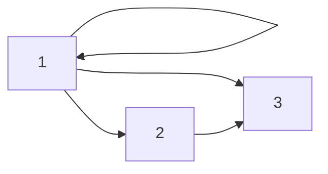

The diagram shows:
1. A loop from vertex 1 to itself (for (1,1))
2. An edge from 1 to 2 (for (1,2))
3. An edge from 1 to 3 (for (1,3))
4. An edge from 2 to 3 (for (2,3))

---

A **digraph** is an ordered pair of sets $G=(V,E)$ where $V$ is the set of vertices and $E$ is the set of edges(ordered pairs).

In the example, 
- Vertex set V = {1, 2, 3}
- Edge set E = {(1,1), (1,2), (1,3), (2,3)}


---


### Digraph representation of binary relations

- Let $R$ be a binary relation on $A$, that is $R\subseteq A\times A$
- $G$ representing $R$ can be constructed as
	- The vertices are the elements of $A$
	- $(x,y)$ is an edge from vertex $x$ to vertex $y$ if and only if $(x,y)\in R$.
	


---

The less than relation $R$ on  $A = \{1, 2, 3, 4\}$ is $\{(1, 2) , (1, 3), (1, 4), (2, 3) , (2, 4) , (3, 4) \}$: 

---

```mermaid
graph LR
    1 --> 2
    1 --> 3
    1 --> 4
    2 --> 3
    2 --> 4
    3 --> 4
 ```
- **loop**: An edge from a vertex to itself.
- **in-degree of a vertex**: The number of edges coming to the vertex
- **out-degree**: The number of edges going out of the vertex
- **path**: A path from $x_0$ to  $x_n$ is sequence of vertices 
  - that satisfies $(x_i,x_{i+1})\in E$ for all $i$, $1\leq i\leq n-1$.

---


### Matrix Representation of Relations

A relation $R$ from $A$ to $B$ can be represented by matrix $M=[m_{ij}]$, where
```math
m_{ij}=\begin{cases}
    1,& \text{if } (a_i,b_j)\in R\\
    0,              &\text{if } (a_i,b_j)\notin R 
\end{cases}
```

---

Suppose $A = \{1, 2, 3\}$ and $B = \{1, 2\}$.  

The relation $R$ from $A$ to $B$ is defined as $(a,b)\in R$ if $a\in A$ and $b\in B$ and $a>b$.

The matrix representation is  
```math
M_R= \begin{bmatrix}
0&0\\1&0\\1&1
\end{bmatrix}
```

---

Suppose $A = \{a_1, a_2, a_3\}$ and $B = \{b_1, b_2,b_3,b_4,b_5\}$.\\

What are the ordered pairs of relation $R$ represented by the matrix:

```math
M_R= \begin{bmatrix}
0&1&0&0&0\\1&0&1&1&0\\1&0&1&0&1
\end{bmatrix}?
```

---

# Operations on relations

---
### Set Operations 


- A relation is a set. All set operations such as $\cup, \cap$ apply to the relations.

  - The union of the ``less than" and ``equality" relations on the set of integers is the ``less than or equal" relation on the set of integers.


---

**example**

Let $A = \{1, 2, 3\}$ and $B = \{1, 2, 3, 4\}$. 

The relations $R1 = \{(1, 1), (2, 2), (3, 3)\}$ and $R2 = \{(1, 1), (1, 2), (1, 3), (1, 4)\}$ can be combined to obtain

- $R1 \cup R2 = \{(1, 1), (1, 2), (1, 3), (1, 4), (2, 2), (3, 3)\},$
- $R1 \cap R2 = \{(1, 1)\}$,
- $R1 - R2 = \{(2, 2), (3, 3)\},$
- $R2 - R1 = \{(1, 2), (1, 3), (1, 4)\}$.

---

**example**

- $A$: set of students, $B$: set of courses
- $R1$: student-course relation: if $(a, b) \in R1$, then student $a$ has taken course $b$.
- $R2$: student course relation for graduation: if $(a, b) \in R2$, then student $a$ has to take  course $b$ to graduate.


What are the relations $R1 \cup R2 , R1 \cap R2 , R1 \oplus R2, R1 - R2,$ and $R2 - R1$?

---

### Composition
- If Ahmet is my father **(parent-child relation)** and Ayse is Ahmet's sister **(sister relation)**, 
- then Ayse is my aunt (**aunt-nephew/niece relation)**. 

---

- Given relations $R_1\subseteq A\times B$ and $R_2\subseteq B\times C$;

- **composite relation:**
 $R_1\circ R_2 \subseteq A\times C$ is defined by the rule  
$(a,c)\in (R_1\circ R_2)$ if and only if there exists some $b\in B$ such that $(a,b)\in R_1$ and $(b,c)\in R_2$.

---

- **In infix notation:** 
  - $a(R_1\circ R_2)c \leftrightarrow \exists b: aR_1b \wedge bR_2c$

---

- **In matrix terms,** composition acts like multiplication:
  - $(R_1\circ R_2)_{ij}=  \vee_k(R_1(i,k)\wedge R_2(k,j))$

---

**Example**:

- Let $A = \{a_1 , a_2\}$ , $B = \{b_1 , b_2 , b_3\}$ , and $C = \{c_1 , c_2\}$.
-  Let $R_1 = \{(a_1 , b_1) , (a_1 , b_2) , (a_2 , b_3) \}$ , and $R_2 = \{(b1 , c1) , (b2 , c1) , (b_2 , c_2) , (b_3 , c_1) \}$.
 
What is $R_1R_2$?

---

What is $R_1R_2$?
- $R_1R_2 = \{(a_1 , c_1) , (a_1 , c_2) , (a_2 , c_1) \}$. 

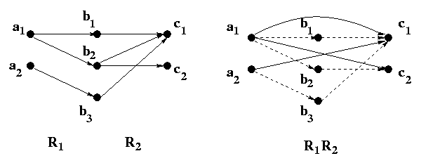


---
### $R^2$
If $R$ is a parent-child relation on a set of people $A$, what is $RR$?

---

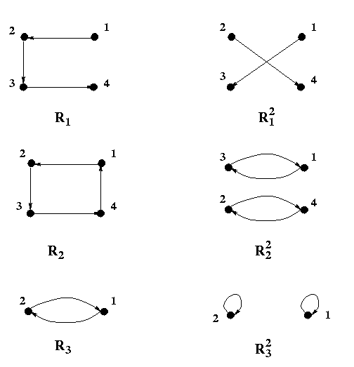

---


### Properties of Composite Relations
Let $R_1$ be a relation from $A$ to $B$, and $R_2$ and $R_3$ from $B$ to $C$:

- $R_1(R_2R_3)=(R_1R_2)R_3$
- $R_1(R_2\cup R_3)=R_1R_2\cup R_1R_3$
- $R_1(R_2\cap R_3)\subseteq R_1R_2\cap R_1R_3$

---

The powers of binary relation $R$ on a set $A$ is:

- $R^{m+n} = R^mR^n$
- $(R^m)^n= R^{mn}$
- $xR^ny$ if and only if there is a path of exactly $n$ edges from $x$ to $y$.


---

**theorem**  
Let $R$ be a relation on a set $A$. There is a path of length $n$, from $a$ to $b$ iff $(a, b) \in R^n$.

**proof by induction:**

---

- For $n=1$, there is a path from $a$ to $b$ if and only if $(a,b)\in R$. 
- Assume it for $n$. There is a path of length $(n+1)$ from $a$ to $b$ iff there exists $c\in A$ such that
  -  there is an edge from $a$ to $c$ and
     - this happens iff $(a,c)\in R$
   - a path length $n$ from $c$ to $b$.
     - by induction hypothesis, this happens iff $(c,b)\in R^n$ 

  - $(a,b)\in R^{n+1}$ iff there exists $c\in A$ such that $(a,c)\in R$ and $(c,b)\in R^n$.
  - So there is a path of length $n+1$ from $a$ to $b$ iff $(a,b)\in R^{n+1}$.
 

---

**What is $R^n$?**  

Let $R$ be the relation on the set of all people in the world that contains $(a, b)$ if $a$ has met $b$.  


---

**What is $R^n$?**

- The relation $(a,b)\in R^2$ if there is a person $c$ such that $(a, c) \in R$ and $(c, b) \in R$,
that is, if there is a person $c$ such that $a$ has met $c$ and $c$ has met $b$. 
- Similarly, $(a,b)\in R^n$ if there are people $x_1 , x_2,\dots, x_{n-1}$ such that
  -  $a$ has met $x_1$,
  -  $x_1$ has met $x_2$, ...
  -  and $x_{n-1}$ has met $b$.


see [https://www.csauthors.net/](https://www.csauthors.net/)


---

**The connectivity relation $R^*$**

 What is  
 ```math
 R^{*}=\bigcup_{n=1}^\infty R^n?
 ```
 - $(a, b)\in R^{*}$ if there is a sequence of people, 
 starting with $a$ and ending with $b$, such that each person in the sequence has met the next person in the sequence. 


---

**example**  

Let $R$ be the relation on the set of all metro stops in Istanbul. 
- $(a, b)\in R$ indicates it is possible to travel from stop $a$ to stop $b$ without changing trains.

  
**What is $R^n$?**  
**What is $R^{*}$?** 

---

 - $(a,b)\in R^n$  if it is possible to travel from stop $a$ to stop $b$ by making
at most $n-1$ changes of trains. 
- $(a, b)\in R^{*}$ when it is
possible to travel from stop $a$ to stop $b$ making as many changes of trains as necessary.


---

# Properties of Binary Relations

---

### Classifying Binary Relations
 A relation $R$ on a set $A$ is 

- **reflexive** if $(a,a)\in R$ for all $a\in A$.
- **irreflexive** if $(a,a)\notin R$ for all $a\in A$.


---

- **symmetric** if  $(a,b)\in R$ and $(b,a)\in R$
- **antisymmetric** if $aRb\wedge bRa \rightarrow a=b.$
  - The relations $\subseteq, \leq$ are antisymmetric.

---

- **transitive** if $(a,b)\in R$ and $(b,c)\in R$ implies $(a,c)\in R$.

  - The relations $=,<,\leq$ are all transitive.
  - The relation $\{(x,x+1)\mid x\in \mathbb{N}\}$ is not.


---

What properties hold for the relations in the figure?

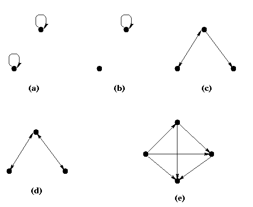


---

- (a) is reflexive, antisymmetric, symmetric and transitive, but not irreflexive.  
- (b) is neither reflexive nor irreflexive, and it is antisymmetric, symmetric and transitive. 
- (c) is irreflexive but has none of the other four properties.  
- (d) is irreflexive, and symmetric, but none of the other three.  
- (e) is irreflexive, antisymmetric and transitive but neither reflexive nor symmetric. 

---


# Closure of Binary Relations

---

### Closure

- The closure of a relation is the smallest extension of the relation that has certain property such as reflexivity, symmetry, etc..

**reflexive closure**

- A relation $R'$ is the reflexive closure of a relation $R$ if and only if
  - $R'$ is reflexive
  - $R\subseteq R'$, and
  - for any relation $R''$, if $R\subseteq R''$ and $R''$ is reflexive, then $R'\subseteq R''$.


---

**Example**: Let $R = \{(a,b)\mid a\in \mathbb{N}\wedge b\in \mathbb{N} \wedge a<b\}$\\
Then, the reflexive closure of $R$ is

```math
r(R)=\{(a,b)\mid a\in \mathbb{N}\wedge b\in \mathbb{N} \wedge a\leq b\}.
```

- The reflexive closure is obtained by adding $(a,a)$ to $R$ for all $a$ in $R$'s domain:
- in digraph terms, by adding a self-loop at all nodes.


---

**Example (symmetric closure)**: For less than relation on $\mathbb{N}$;
 the symmetric closure of $R$ is 
```math
s(R)=\{(a,b)\mid a\in \mathbb{N}\wedge b\in \mathbb{N} \wedge [a< b \vee a>b] \}
```
That is
```math
s(R)=\{(a,b)\mid a\in \mathbb{N}\wedge b\in \mathbb{N} \wedge a\neq b\}.
```

- The symmetric closure is obtained by adding $(b,a)$ whenever $(a,b)\in R$:
- in digraph terms,  by adding an edge in the reverse direction (if not there) for every edge.


---

**Example (transitive closure):** For less than relation on $\mathbb{N}$; the closure is the relation itself.  
The transitive closure of a parent-child relation is the ancestor-descendant relation. 

- The transitive closure is obtained by adding $(x,z)$ whenever $(x,y)\in R$ and $(y,z)\in R$:
- in digraph terms, by adding an edge for each directed path through the graph.


---

Reflexive, symmetric, and transitive closure of a relation.

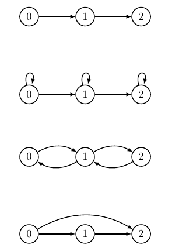

---

Reflexive, symmetric, and transitive closure of a relation.

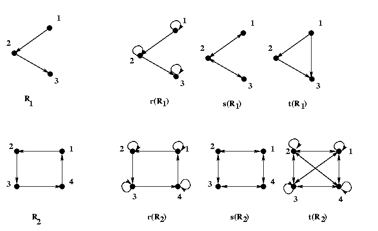


---

# Equivalence relations

---

### Equivalence relations
A binary relation $R$ on a set $A$ is an equivalence relation iff $R$ is 
- reflexive,
- symmetric, and
- transitive.


---

### Equivalence relations
- The congruent **mod $m$** relation on set of integers:  
  $\{(a,b)\mid a\equiv b\mod m\}$, where $m>1$.
- Taking this course together this semester

---

- The digraph of the equivalence relation congruent $\mod 3$ on $\{0,1,2,3,4,5,6\}$.

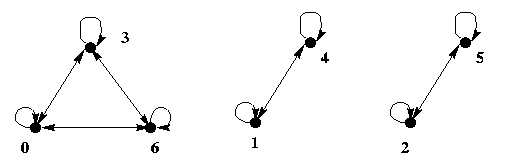


---

### Equivalence class
For the equivalence relation $R$ on a set $A$;
the equivalence class of element $a$ of $A$  is denoted by $[a]$

- For the equivalence relation of hours on a clock, the equivalence classes are:

  - $[1]=\{1,13,25,...\}=\{1+12m: m\in \mathbb{N}\}$
  - $[2]=\{2,14,26,...\}=\{2+12m: m\in \mathbb{N}\}$

- The set is **partitioned** into equivalence classes by an equivalence relation on $A$


---

### Partition
Let $A$ be a set and $A_1, A_2,\dots, A_n$ be subsets of $A$. Then $\{A_1, A_2,\dots, A_n\}$ is a partition of $A$ iff

  - $\cup_{i=1}^nA_i=A$
  - $A_i\cap A_j= \emptyset$ if $A_i\neq A_j$

$A_i$ is called a **block** of the partition. 


---

**example**  

 Let $A = \{1, 2, 3, 4, 5\}$,  
 - $A1 = \{1, 5\}, A2 = \{3\}$, and $A3 = \{2, 4\}.$ $\{A1, A2, A3\}$ is a partition of $A$. 
 -  $B1 = \{1, 2, 5\}, B2 = \{2, 3\},$ and $B3 = \{4\}$ is not a partition: $B1 \cap B2 \neq \emptyset$
  


---


- $A$ is a set.
- $R$ a binary relation on $A$

**theorem**
Let $\{A_1, ..., A_n\}$ be a partition of a set $A$. 
If $(a, b) \in  R$ iff $a \in A_i$ and $b \in A_i$ for some $i$, $1 \leq  i \leq  n$, then $R$ is **an equivalence relation.**


---

### Equivalence relation: each condition implies the other

1. A relation $\sim$ is reflexive, symmetric, and transitive
2. There is a partition of $A$ into **disjoint equivalence classes $A_i$** such that $x\sim y$ iff $x\in A_i$ and $y\in A_i$ for some $i$. 
3. There is a set $B$ and a function $f:A\rightarrow B$ such that $x\sim y$ iff $f(x)=f(y).$


---

### Proofs:
$(1\rightarrow 2):$

-  For each $x\in A$, let $A_x = [x]_\sim = \{y\in A\mid y\sim x\}$. Let the partition be $\{A_x\mid x\in A\}$: By reflexivity, $x\in A_x$ for each $x$; so $A=\bigcup_xA_x$.

---

- To show distinct equivalence classes are disjoint, suppose $A_x\cap A_y\neq \emptyset$. 
  
---


- Then, there is some $z$ such that $z\in A_x$ and $z\in A_y$: That means $z\sim x$ and $z\sim y$. From the symmetry, $x\sim z$ and $y\sim z$.
  
---
- If $q\in A_x$, then $q\sim x\sim z\sim y$. Then $q\in A_y$.

---

- Conversely,If $q\in A_y$, then $q\sim y\sim z\sim x$. Then $q\in A_x$. This shows $A_x=A_y$ if $A_x\cap A_y\neq \emptyset$.


---

$(2\rightarrow 3):$

-  Let $f(x)=A_x$.   
   - Then $x\sim y\rightarrow x\in A_y\rightarrow A_x\cap A_y\neq \emptyset$. 
   - We have shown before that if this is the case, then $A_x=A_y$, giving $f(x)=f(y)$.
   - Conversely, if $f(x)\neq f(y)$, 

then $A_x\neq A_y$, giving $A_x\cap A_y=\emptyset$. That means, $x\in A_x$ and $x\notin A_y$, so $x\nsim y$.


---

$(3\rightarrow 1):$

- Suppose $x\sim y$ iff $f(x)=f(y)$ for some $f$. Then $f(x)=f(x)$ so $x\sim x$: $\sim$ is reflexive.

---

- If $x\sim y$, then $f(x)=f(y)$, giving $f(y)=f(x)$ and thus $y\sim x$: $\sim$ is symmetric.

---

- If $x\sim y \sim z$, then $f(x)=f(y)=f(z)$, giving $x\sim z$. That means $\sim$ is transitive.


---

# Partial Ordering
### Order Relations
- Lines in the grocery stores(marketlerde sira): customers are served in cashier first-come-first-served (FCFS or FIFO) basis.
-  Cars waiting for traffic signal to change are also ordered similarly.
- Natural numbers can be ordered, too.
- The order relations are abstraction of these relations.


---

### Partial Ordering
A binary relation ${R}$ on a set ${A}$ is a **partial order** if and only if ${R}$ is
- reflexive
- antisymmetric
- transitive

When ${R}$ is a partial order, the pair $(A,R)$ is called a **partially ordered set** (**poset**).

---
### Examples

- $\leq$ relation on the set of integers $Z$, is a partial order.$\left(Z, \leq \right)$ is a poset.

  - to prove, show $\leq$ is reflexive, antisymmetric, and transitive. 

- The subset relation $\subseteq$ on the power set of $\{1,2\}$ is a partial order. The set with the subset relation is a poset.


---

### How to turn $R$ into a partial order

- Antisymmetry is not a closure property: $R$ cannot be made antisymmetric by adding pairs.
- Let $R'$ be transitive and reflexive closure of $R$.
- If $R'$ is not antisymmetric:
  - The relation $\sim$ defined by $x\sim y$ if $xR'y$ and $yR'x$ is an equivalence relation.
  - A quotient relation $R'/\sim$ will be a partial order
  - this is equivalent to the graph algorithm that computes strongly connected components 


---

### Example
Each strongly connected component has been contracted to a single vertex to produce acyclic graph.
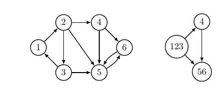


---

### Comparability

- The elements $a$ and $b$ of a poset $(S, \preceq)$ are called **comparable** if either $a \preceq b$ or $b \preceq a$.

  - In the poset $(Z^+,\mid)$, 3 and 9 comparable. 

-  When neither $a \preceq b$ nor $b\preceq a$, $a$ and $b$ are called **incomparable**.
   - In the poset $(Z^+,\mid)$, 5 and 7 incomparable. 

---

- **In partial orderings**, some pairs may be incomparable.
-  When every two elements in the set are comparable, the relation is called a
**total ordering.**


---

### Order Relation

- minimal-maximal element
- least-greatest element
- Hasse diagram
- total order
- topological order and sorting algorithm 


---

### minimal/maximal element 
Let $(A, \preceq)$ be a poset, where $\preceq$ represents an arbitrary partial order.
\begin{itemize}
- An element $b\in A$ is a **minimal element** if there is no element $a\in A$ such that $a\preceq b$.

---

**Example**:
The set of $\{\{1\},\{2\},\{1,2\}\}$ with the relation $\subseteq$ has two minimal elements: $\{1\}$ and $\{2\}$.
 
 
---
 
### least/greatest element
Let $(A, \preceq )$ be a poset.
\begin{itemize}
- An element $b\in A$ is the **least element** if for every  element $a\in A$, $b\preceq a$.

---

**Example**:

The set $\mathbb{N}$ with the relation $\leq$ has the least element.   

**Example:** 
The set of $\{1,2\}$ with the relation $\subseteq$ has the least element $\emptyset$.

---


### Hasse Diagram
 A digraph of a binary relation on a set can be simplified if the relation is a *partial order**.

A Hasse diagram is  **a graph for a poset** such that

- it does not have any loops
- all edges in the diagram points upward (initial vertex is below the terminal vertex for each edge)

---

**Drawing**:
 - Remove loops (a partial order is reflexive)
 - Remove $(a, b)$ if $(a,c)$ and $(c,b)$ exist in the relation (a partial order is transitive).
  


---

### Hasse Diagram

**Example**: Constructing the Hasse diagram for 
$(\{1, 2, 3, 4\},\leq ).$ 
 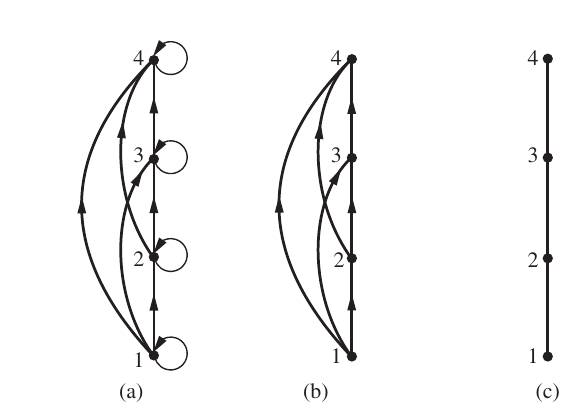
 \end{figure}

---

### Hasse Diagram

**Example**: Constructing the Hasse diagram for 
$(\{1, 2, 3, 4,6,8,12\},\mid ).$ 
 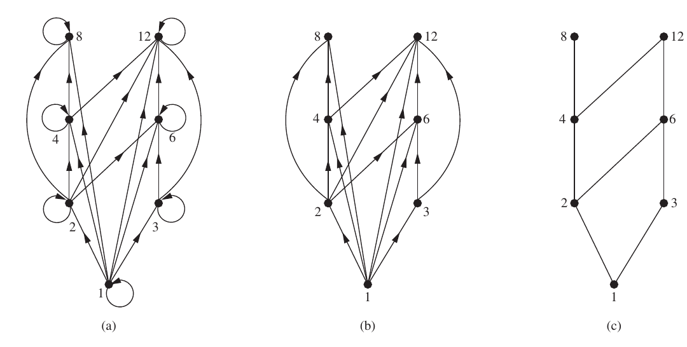


---


### Total Order
A binary relation ${R}$ on a set ${A}$ is a **total order** if and only if ${R}$ is
- a partial order
- For any pair of elements $a,b$ of $A$, $(a,b)\in R$ or
$(b, a)\in R$

  - Every element is related to every element one way or the other (**every pair is comparable!**).


**Example**: $\leq$ on the set of integers $Z$ is a total order.


---


### well order
A total order $R$ on a set $A$ is **a well order** if every non-empty subset of $A$ has **a minimum  element**.

**Example**:
The poset of $\mathbb{N}$ with  $\leq$ relation is a well order. Because, every set of natural numbers has the least element.

**Example**: The poset of $\mathbb{R}$ with  $\leq$ relation is not a well order.

---


### Compatible total ordering

- Any partial order can be extended to a total order.
- We can linearly sort the elements in a finite poset while preserving the partial order (**compatible total ordering**)

---

**Example**:  
The set $\{\emptyset, \{1\},\{2\},\{1,2\}\}$ with the partial order $\subseteq$:
- We can order it as: $\{\emptyset, \{1\},\{2\},\{1,2\}\}$
-  or $\{\emptyset, \{2\},\{1\},\{1,2\}\}$
- A set appears before another if it is a subset of the other.

---

> In real life, tasks for manufacturing goods in general can be partially ordered based on the prerequisite relation, that is certain tasks must be completed before certain other tasks can be started. For example the arms of a chair must be carved before the chair is assembled. Scheduling those tasks is essentially the same as arranging them with a linear order (ignoring here some possible concurrent processing for simplicity's sake). 


---


### Topological Sort


The topological sorting is the procedure to find a linear (total) order that does not violate the partial order.

- Remove a minimal element from the given poset
- Repeat \structure{(1.)} for the resulting set until no more elements left


---

### Algorithm: Topological Sorting of a Finite Poset

**Input:** A finite poset $(S, \subseteq)$.  
**Output:** A sequence of the elements of $S$ preserving the order.  

1. $k \gets 1$  
2. **While** $S \neq \emptyset$ **do**  
   - $a_k \gets$ a minimal element of $S$  
   - 
```math
S \gets S \setminus \{a_k\}
```  
   -   $k \gets k + 1$  
3. **Return** $a_1, a_2, \dots, a_n$  *(This is a compatible ordering of $S$ )*  

---

#### Explanation:

- **Step 1:** Initialize a counter $k$ to 1.  
- **Step 2:** While the set $S$ is not empty:  
  - Select a minimal element $a_k$ (an element with no predecessors under $\subseteq$).  
  - Remove $a_k$ from $S$.  
  - Increment $k$.  
- **Step 3:** Return the sequence $a_1, a_2, \dots, a_n$, which is a topological order of $S$.  

This algorithm performs a topological sort on a partially ordered set (poset) by repeatedly removing minimal elements, resulting in a linear extension of the order.  

---


### 
**Example**: Steps of the topological sort for a Hasse diagram.
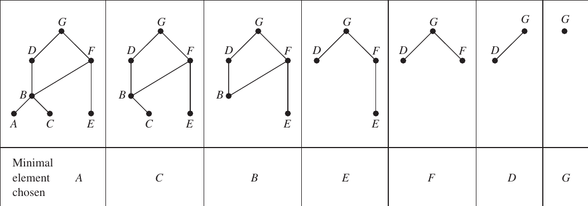

---

**Exercise**: For the set
```math
\{\{1\}, \{2\}, \{3\}, \{1, 2\}, \{1, 3\}, \{2, 3\}, \{1, 2, 3\}\}
```
 with the partial order $\subseteq$; draw the steps of the topological sort?

---
### Upper/lower bound
Let $A$ be a subset of a poset $(S,\preceq)$

- Upper bound: If $u\in S$ such that $a\preceq u$ for all $a\in A$, $u$ is a upper bound of $A$.
- Lower bound: If $l\in S$ such that $l\preceq a$ for all $a\in A$, $l$ is a upper bound of $A$.

---

**Lattice**

If every element of a poset has both a least upper bound and a greatest lower bound, then this poset is called a **lattice**.


---

- Which one is not a lattice?

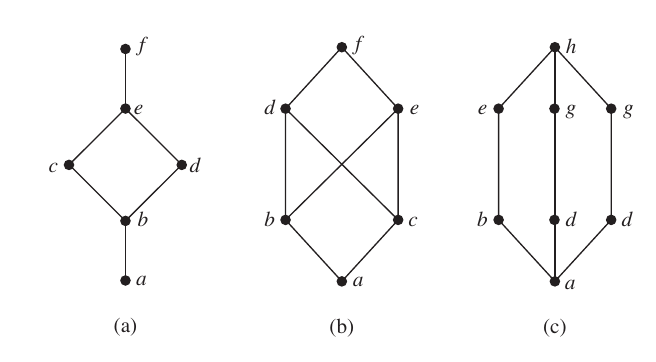

---

- Is the poset $(Z^+,\mid)$ a lattice?
  - For any $a,b\in Z^+$, the least upper bound and the greatest lower bounds are $\textbf{lcm}(a,b)$ and $\gcd(a,b)$. So this poset is a lattice. 


---

### The lattice model of information flow
For example, the multilevel security policy used in the military:

-  Each piece of information is assigned to a security class, - Each security class is represented by a
pair $(A, C)$
   - $A$ is an authority level: unclassified, confidential, secret, top secret.
   - $C$ is a category: a subset of compartments

---

 - Security classes are ordered: $(A_1,C_1) \preceq (A_2,C_2)$ iff $A_1\leq A_2$ and $C_1\subseteq C_2$. 
 - Information is permitted to flow from the security class  $(A_1,C_1)$ to $(A_2,C_2)$ iff $(A_1,C_1) \preceq (A_2,C_2)$.

People and computer programs are then allowed access to information from a specific restricted set of security classes.

