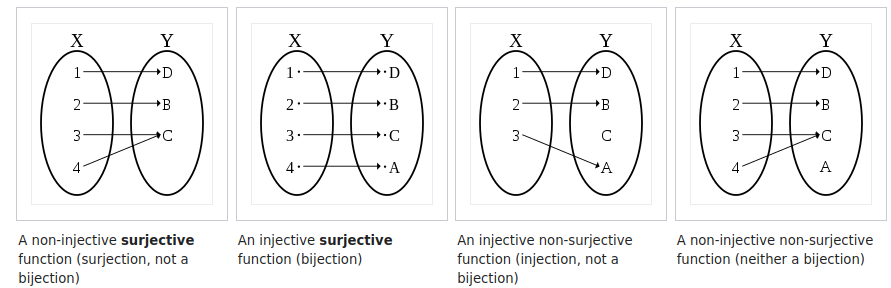
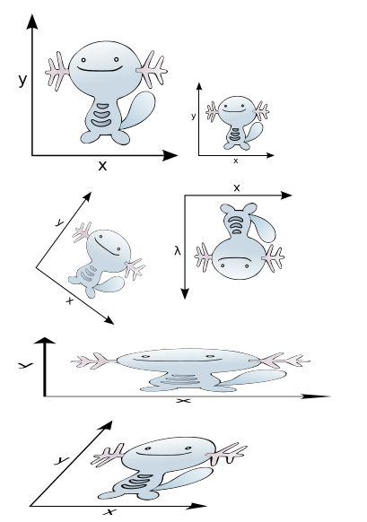

<style type="text/css">
div {
  font-size: clamp(11px, 3vw, 28px);
}

</style>

# Basic Structures: Sets, Functions, Matrices  

---

## Set Theory  
> **Core Idea**: Everything in mathematics (numbers, functions, etc.) can be defined in terms of sets.  
> - If sets behave consistently, so does everything built on them.  
> - **Analogy**:  
>   - Predicate logic = Machine code  
>   - Set theory = Assembly language  

---

### Set Membership ($\in$)  
**Key Predicate**: The **membership** relation $x \in S$ ("$x$ is an element of $S$").  
- A set $S$ is **uniquely defined** by its elements.  
- All set operations can be derived from $\in$.  

**Examples**:  
- Tom $\in$ {Tom,Jerry}  
- $4 \in \mathbb{N}$  
- 1 $\notin$ \{\{1\}\} (membership is not transitive!)  

**Symbols**:  
- $\notin$: "Not an element of"  
- $\ni$: Reverse membership (e.g., $\mathbb{N} \ni 4$).  

---

## Naive Set Theory  
**Definition**: Any "plausible" collection of elements is a set.  
- Elements can be **sets** or **urelements** (non-set primitives).  

**Examples**:  
- Explicit notation:  
  - `∅ = {}` (empty set)  
  - `{Tom}, {Jerry}`  
  - `N={0,1,2,…}`
  - `{∅,{0},{1},{0,1},7}` 

⚠️ **Warning**: Unrestricted set comprehension leads to paradoxes( Russell’s Paradox:) 
```math
\{ S \mid S \notin S \}
```

---

### Set Comprehension  
Define sets using rules (**set-builder notation**):  
- **Primes**: 
```math
\{x \in \mathbb{N} \mid x > 1 \land (\forall y,z \in \mathbb{N},\ yz = x \implies y=1 \lor z=1)\} 
```
- **Even numbers**: 
```math
  \{2x \mid x \in \mathbb{N}\} 
```
- **Small naturals**: 
  ```math
  \{x \in \mathbb{N} \mid x < 12\}
  ```

---

**Programming Analogy** (**List Comprehension**):  

set comprehension: `{ x | 0 ≤ x ≤ 100, x = 1 (mod 2) }`
  
**List Comprehension:**
```python  
# Python  
[x for x in range(101) if x % 2 == 1]  
```  
```haskell  
-- Haskell  
[x | x <- [0..100], x `mod` 2 == 1]  
```  

---

## Operations on Sets  

### Fundamental Operations  
- **Union**: 
  ```math
  A \cup B = \{x \mid x \in A \lor x \in B\}
  ``` 
- **Intersection**: 
  ```math
  A \cap B = \{x \mid x \in A \land x \in B\}
  ``` 
- **Difference**: 
  ```math
  A \setminus B = \{x \mid x \in A \land x \notin B\}
  ```
- **Symmetric Difference**: 
  ```math
  A \Delta B = \{x \mid x \in A \oplus x \in B\}
  ```

---

### Subsets & Supersets  
- **Subset**: $A \subseteq B$ iff $\forall x: x \in A \implies x \in B$  
- **Superset**: $A \supseteq B$ (equivalent to $B \subseteq A$)  
- **Proper Subset**: $A \subsetneq B$ means $A \subseteq B$ but $A \neq B$.  

⚠️ **Ambiguity Alert**:  
- "$A$ is **in** $B$" could mean $A \in B$ (membership) or $A \subseteq B$ (subset).  
- Example: 
```math
\{12\} \in \{\text{Moe}, \text{Larry}, \text{Curly}, \{12\}\}
```
  - but $\{12\} \not\subseteq$ the same set.  

---

### Complement  

- **Complement**: 
```math
\overline{A} = \{x \mid x \notin A\}
```
 (requires a fixed **universe** $U$).  
- In practice, use $U \setminus A$ instead of $\overline{A}$ to avoid paradoxes.  

---

## Proving Things About Sets  

### Three Core Proof Strategies  
1. **Membership**: Show $x \in S$ using the definition of $S$.  
2. **Subset**: Show $S \subseteq T$ by proving $\forall x \in S: x \in T$.  
3. **Equality**: Show $S = T$ via $S \subseteq T$ **and** $T \subseteq S$.  

---

### Negative Proofs  
- **Non-Membership**: Find a counterexample for $x \in S$.  
- **Non-Subset**: Find $x \in S$ but $x \notin T$.  
- **Inequality**: Prove $S \nsubseteq T$ or $T \nsubseteq S$.  

---

## Example Lemma & Proof  

**Lemma**: For all sets $S, T$ and predicate $P$:  
1. $S \supseteq S \cap T$  
2. $S \subseteq S \cup T$  
3. `S ⊇ {x ∈ S ∣ P(x)}`
4. $S = (S \cap T) \cup (S \setminus T)$  


---

### Proof of Lemma  

#### 1. $S \supseteq S \cap T$  
- Let $x \in S \cap T$.  
- By definition, $x \in S$ **and** $x \in T$.  
- Thus, $x \in S$.  
- Since $x$ is arbitrary, $S \cap T \subseteq S$.  

---

#### 2. $S \subseteq S \cup T$  
- Let $x \in S$.  
- Then $x \in S \lor x \in T$ is true.  
- Hence, $x \in S \cup T$.  

---

#### 3. `S ⊇ {x ∈ S ∣ P(x)}`  
- Let `x ∈ { x ∈ S ∣ P(x) }`.  
- By definition, $x \in S$ (regardless of $P(x)$).  

---

#### 4. $S = (S \cap T) \cup (S \setminus T)$  
- **Step 1**: Show $S \subseteq (S \cap T) \cup (S \setminus T)$:  
  - For $x \in S$, either $x \in T$ (so $x \in S \cap T$) or $x \notin T$ (so $x \in S \setminus T$).  
- **Step 2**: Show $(S \cap T) \cup (S \setminus T) \subseteq S$:  
  - If $x \in (S \cap T)$ or $x \in (S \setminus T)$, then $x \in S$.  
- Equality follows from bidirectional inclusion.  

---

---

## Axiomatic Set Theory (ZFC)  

### Why ZFC?  
Naive set theory allows paradoxes (e.g., Russell’s Paradox). **Zermelo-Fraenkel (ZFC) axioms** restrict set construction to avoid contradictions.  

---

### Key points (Short version)
you can construct sets by
- listing their members, 
- taking the union of other sets, 
- taking the set of all subsets of a set, 
- using some predicate to pick out elements or subsets of some set. 

---

### Key Axioms of ZFC  
1. **Extensionality**:  
   - Sets with the same elements are equal:  
 ```math
 \forall x, y: (x = y) \leftrightarrow (\forall z: z \in x \leftrightarrow z \in y)
 ``` 
1. **Existence:** The empty set `∅` is a set. 
  `∃x : ∀y : y ∉ x`.

1. **Pairing**:  
   - For any sets $x, y$, the pair $\{x, y\}$ exists.  

2. **Union**:  
   - For any set of sets $S$, the union $\bigcup S$ exists.  

---

5. **Power Set**:  
   - For any set $S$, the power set $\mathcal{P}(S)$ (all subsets of $S$) exists.  
   - **Example:** Power set of `{0, 1, 2}`?
     - `{∅, {0}, {1},{2}, {0,1}, {0,2}, {1,2}, {0,1,2}}`

---

6. **Specification (Restricted Comprehension)**:  
   - For any set $S$ and predicate $P$, $\{x \in S \mid P(x)\}$ exists.     
     - it generates infinite list of axioms, one for each possible P 
     - limits constructing subsets of existing sets , we can’t construct `S = {x | x ∉x}`. 
     -  we can try to construct `S = {x ∈ T | x ∉ x}`,
        -   S isn’t an element of T, 
        -   so it doesn’t contain itself but also doesn’t create a contradiction.

---

7. **Infinity**: existence of at least one infinite set 
   - There is a set containing `∅`  and `x ∪ {x}` whenever it has `x`.  
     - `∃x : ∅ ∈ x ∧ ∀y ∈ x : y ∪ {y} ∈ x`.
   - This encodes $\mathbb{N}$
     - where `∅` represents `0` 
     - and `x ∪ {x}` represents `x + 1`. 
     - 3 = {0, 1, 2} = {∅, {∅} , {∅, {∅}}}
     - each number n is represented by a set with n elements.


---


1. **Choice**:  
   - For any set of nonempty sets, there exists a function selecting one element from each.  

2. **Foundation:** Every nonempty set A contains a set B with `A∩B = ∅`. 
- `∀x ∉ ∅ : ∃y ∈ x : x ∩ y = ∅.`
- **No set is an element of itself**


---

## Cartesian Products & Relations  

### Ordered Pairs  
- **Definition**: $(a, b) = \{\{a\}, \{a, b\}\}$ (ensures order matters).  
- 
```math
\{a, b\} \neq (a, b)
```
 and 
 ```math
 (a, b) \neq (b, a) \text{ unless $a = b$.}
 ```

- The sets were **unordered!**

---

### Cartesian Product  
- **Definition**:  
```math
A \times B = \{(x, y) \mid x \in A \land y \in B\}
```
- **Example**:  
  - 
  ```math
  \{1, 2\} \times \{3, 4\} = \{(1,3), (1,4), (2,3), (2,4)\}
  ```  
  - 
  ```math
  |A \times B| = |A| \cdot |B|
  ```  

⚠️ **Non-commutative**: $A \times B \neq B \times A$ unless $A = B$.  

---

⚠️ **Non-commutative**: $A \times B \neq B \times A$ unless $A = B$.  
- {1, 2} × {3, 4} = {(1, 3), (1, 4), (2, 3), (2, 4)}
- {3, 4}  × {1, 2} = {(3, 1), (3, 2), (4, 1), (4, 2)}
- {(1, 3), (1, 4), (2, 3), (2, 4)} ≠ {(3, 1), (3, 2), (4, 1), (4, 2)} 
- When are they equal?

---

### Relations  
- A **relation** between $A$ and $B$ is any subset of $A \times B$.  
- **Example**:  
  - "$<$" on $\mathbb{N}$: 
  ```math
  \{(1,2), (1,3), (2,3), \dots\}
  ```
  - Functions are a special type of relation (see below).  

---

## Functions  

### Definition  
A function $f: A \to B$ is a relation where:  
- **Every $x \in A$ maps to exactly one $y \in B$**.  
- **Notation**: $f(x) = y$ for $(x, y) \in f$.  

---

### Key Concepts  
- **Domain**: $A$ (input set).  
- **Codomain**: $B$ (output set).  
- **Image**: $\{f(x) \mid x \in A\}$ (actual outputs).  
- The set of all functions from $A \to B$ is written as $B^A$. 

---


- For **finite domains**, we use explicit table or a formula
  - e.g. from {0, 1, 2, 3, 4} to {a, b, c}, then a table shows the mapping form A to B.
  -  $f(x) = x^2$.

---

- single rule gives different functions:
-  $f(x) = x^2$.
   -  `f: R → R`, 
   - `f: Z → Z`, 
   - `f: N → N`, 
   - `f: Z → N`. 
   - Changing the domain or codomain changes the function.

---

### Function Examples  
1. **Linear Function**:  
   - $f: \mathbb{Z} \to \mathbb{Z},\ f(x) = x + 1$ (bijective).  
2. **Squaring Function**:  
   - $f: \mathbb{N} \to \mathbb{N},\ f(x) = x^2$ (injective but not surjective).  
3. **Floor Function**:  
   - $f: \mathbb{R} \to \mathbb{Z},\ f(x) = \lfloor x \rfloor$ (surjective but not injective).  

---

### Function Composition  
- For $f: A \to B$ and $g: B \to C$, define $g \circ f: A \to C$ as:  
  $$(g \circ f)(x) = g(f(x))$$  
- **Example**:  
  - $f(x) = x^2$, $g(x) = x + 1$ → $(g \circ f)(x) = x^2 + 1$.  
- **Example**: 
  - $g(x) = x + 1$, $h(x) = x^2$ → $(g \circ h)(x)$ = ? 

---

### Function Types  
 `f: A → B`
 - how many elements x of the domain A get mapped to each element y of the codomain B.
- f is **surjective**:
  - If every y is the image of at least one x.
- f is **injective**: 
  - If every y is the image of at most one x.
- f is **bijective**: 
  - If every y is the image of exactly one x.

---

| **Type**       | **Definition**                              | **Example**                     |  
|----------------|---------------------------------------------|---------------------------------|  
| **Injective**  | $f(x) = f(y) \implies x = y$                | $f(x) = 2x$ on $\mathbb{N}$     |  
| **Surjective** | $\forall y \in B, \exists x \in A: f(x)=y$ | $f(x) = x \mod 5$ on $\mathbb{Z}$ |  
| **Bijective**  | Both injective and surjective               | $f(x) = x + 1$ on $\mathbb{Z}$  |  

---



---

Examples:
- $f(x) = x^2$ from N to N
- $f(x) = x + 1$ from N to N
-  $f(x) = x + 1$ from Z to Z
-  $f(x) = x^2$ from Z to Z

## Sequences & Cardinality  

### Sequences as Functions  
- A **sequence** $(a_1, a_2, \dots)$ is a function $a: \mathbb{N} \to A$.  
- **Tuples**: Finite sequences (e.g., $(a, b, c) \in A \times B \times C$).  

---

### Cardinality  
- **Definition**: $|A| = |B|$ iff there’s a bijection $A \leftrightarrow B$.  
  - **Examples:**
    - `|∅| = 0`, 
    - `|{Larry, Moe, Curly}| = 3`
    - `|{x ∈ N | x < 100 ∧ x is prime}|= 25`

--- 

**Finding size with arithmetics:**

**Disjoint sets:**  If `A∩B = ∅`; 
- then `|A ∪ B| = |A| + |B|`.

**Example:** 
- 2-element set {0, 1}
- 3-element set {Wakko, Jakko, Dot} 
- `|A ∪ B| = |A| + |B|` 5-element set {0, 1, Wakko, Jakko, Dot}.

---

**The size of a Cartesian product:**
```
  |A × B| = |A|·|B|.
  |A × B| = |B × A|.
```
```
  A = {a, b}
  B = {0, 1, 2}
  |A × B| = 6
```

---
For a given set S with n elements, the power set P(S)  

**The size of power set**
$|P(S)| = 2^{|S|}$.

- The special case of $|A^B|$, 
- the size of the set of all functions from B to A,  
  - $|A^B| = |A|^{|B|}$ 

---
### Infinite sets
 - **cardinal arithmetic**: Using addition, multiplication as in cardinals, 
- **cardinal numbers**: the sizes
  - finite cardinal numbers are just number: 0,1,2,3
  - $\aleph_0$: aleph-zero, aleph-null, or aleph-nought
    - first infinite cardinal
    - $\aleph_1$ next infinite
 - $N^∗$ = {all finite sequences of elements of N} has size $\aleph_0$.

---


- **Countable Sets**: $\mathbb{N}, \mathbb{Z}, \mathbb{Q}$ (same size as $\mathbb{N}$).  
- **Uncountable Sets**: $\mathbb{R}, \mathcal{P}(\mathbb{N})$ (strictly larger than $\mathbb{N}$).  

---

- **Countable**: anything you can write down using finitely many symbols
- they can be put into a bijection with N or one of its subsets
  - a set is countable if it has the same cardinality as some subset of the set of natural numbers N = {0, 1, 2, 3, ...}. 
    - every element in S corresponds to a different element in N (injection).  

the set of all computer programs in any particular programming language is countable.

---

Show that the set of all integers({0, 1, −1, 2, −2, . . . .
}) is countable.
- find a one-to-one correspondence between the set of positive integers and the set of all integers.
  - `f(n) = n/2` when `n` is `even` 
  - and `f(n) = −(n − 1)/2` when `n` is `odd`.


---

Show that the set of **positive rational numbers** is countable.
- a sequence r1 , r2 , . . . , rn , . . . . 
- every positive rational number is the quotient `p/q` of two positive integers.
```
  1/1, 2/1, 3/1 ....
  1/2, 2/2, 3/2 ...
  1/3, 2/3, 3/3, ...
``` 

---

The set of real numbers is an **uncountable** set

- If it is countable, then the subset of all real numbers that fall between 0 and 1 would also be countable
- real numbers in [0, 1] 
  - r1, r2, r3, . . . . 
  - $r_i = 0.d_{i1}d_{i2}d_{i3}d_{i4}$
- Consider number $r = 0.d_1d_2d_3...$ 
  - given by the rule:
  - $d_i =  4$ if $d_{ii}=4$, 
  - $d_i = 5$ if $d_{ii}\neq 4$.
- This is not any of $r_i$ since it differs at $d_{ii}$ digit.


---

**Cantor's theorem:** Let S be any set. Then there is no surjection `f: S → P(S)`. 


**Exercise:** There are functions `f: N → {0, 1}` that are not computed by any computer program.

---


### Function of more than one argument
- If `f: A × B → C`, we write `f(a, b)` for `f((a, b))`.   

  - a function of k arguments is just a function from a domain of the form `A1 × A2 × . . . Ak` to some codomain `B`.


---

## Matrices  

### Definition  
A **matrix** is a rectangular array of numbers (or elements) arranged in **rows** and **columns**.  
- An $m \times n$ matrix has $m$ rows and $n$ columns.  
- **Square matrix**: $m = n$.  
- **Notation**:  
  ```math
  A = \begin{bmatrix} a_{11} & a_{12} & \cdots & a_{1n} \\ a_{21} & a_{22} & \cdots & a_{2n} \\ \vdots & \vdots & \ddots & \vdots \\ a_{m1} & a_{m2} & \cdots & a_{mn} \end{bmatrix}
  ```

---

### Matrix Operations  

#### 1. **Matrix Sum**  
- **Definition**: If $A$ and $B$ are $m \times n$ matrices, then $A + B$ is the $m \times n$ matrix with entries:  
```math
(A + B)_{ij} = A_{ij} + B_{ij}
```
- **Example**:  
```math
\begin{bmatrix} 1 & 2 \\ 3 & 4 \end{bmatrix} + \begin{bmatrix} 5 & 6 \\ 7 & 8 \end{bmatrix} = \begin{bmatrix} 6 & 8 \\ 10 & 12 \end{bmatrix}
```

#### 2. **Matrix Product**  
- **Definition**: If $A$ is $m \times k$ and $B$ is $k \times n$, then $AB$ is the $m \times n$ matrix where:  
```math
(AB)_{ij} = \sum_{r=1}^k A_{ir} B_{rj}
``` 
- **Example**:  
```math
\begin{bmatrix} 1 & 2 \\ 3 & 4 \end{bmatrix} \begin{bmatrix} 5 & 6 \\ 7 & 8 \end{bmatrix} = \begin{bmatrix} 1\cdot5 + 2\cdot7 & 1\cdot6 + 2\cdot8 \\ 3\cdot5 + 4\cdot7 & 3\cdot6 + 4\cdot8 \end{bmatrix} = \begin{bmatrix} 19 & 22 \\ 43 & 50 \end{bmatrix}
``` 

⚠️ **Non-commutative**: $AB \neq BA$ in general.  

---

### Special Matrices  

#### 1. **Identity Matrix**  
- A square $n \times n$ matrix with $1$s on the diagonal and $0$s elsewhere:  
```math
I_n = \begin{bmatrix} 1 & 0 & \cdots & 0 \\ 0 & 1 & \cdots & 0 \\ \vdots & \vdots & \ddots & \vdots \\ 0 & 0 & \cdots & 1 \end{bmatrix}
```  
- **Property**: For any $m \times n$ matrix $A$, $A I_n = A$ and $I_m A = A$.  

#### 2. **Zero Matrix**  
- A matrix where all entries are $0$.  

#### 3. **Transpose**  
- **Definition**: Flip rows and columns. If $A$ is $m \times n$, then $A^T$ is $n \times m$ with $(A^T)_{ij} = A_{ji}$.  
- **Example**:  
```math
\begin{bmatrix} 1 & 2 \\ 3 & 4 \end{bmatrix}^T = 
\begin{bmatrix} 1 & 3 \\ 2 & 4 \end{bmatrix}
``` 

---

### Powers of Square Matrices  
- For a square matrix $A$, define $A^k = A \cdot A \cdot \ldots \cdot A$ ($k$ times).  
- **Example**:  
```math
A = \begin{bmatrix} 1 & 1 \\ 0 & 1 \end{bmatrix} \implies A^2 = \begin{bmatrix} 1 & 2 \\ 0 & 1 \end{bmatrix}, \quad A^3 = \begin{bmatrix} 1 & 3 \\ 0 & 1 \end{bmatrix}
``` 

---

## Zero-One Matrices  

### Definition  
Matrices where all entries are **0 or 1**. Used in Boolean algebra and graph theory.  

### Boolean Operations  
- **Join (OR)**: $A \lor B$ replaces addition.  
- **Meet (AND)**: $A \land B$ replaces multiplication.  

---

### Boolean Product  
- **Definition**: For $A$ ($m \times k$) and $B$ ($k \times n$), the Boolean product $A \odot B$ is:  
```math
(A \odot B)_{ij} = \bigvee_{r=1}^k (A_{ir} \land B_{rj})
```
  - **AND** ($\land$) for multiplication, **OR** ($\lor$) for summation.  

**Example**:  
```math
A = \begin{bmatrix} 1 & 0 \\ 
0 & 1 \end{bmatrix}, 
\quad 
B = \begin{bmatrix} 1 & 1 \\ 0 & 1 \end{bmatrix}
```
```math
A \odot B = \begin{bmatrix} (1 \land 1) \lor (0 \land 0) & (1 \land 1) \lor (0 \land 1) \\ (0 \land 1) \lor (1 \land 0) & (0 \land 1) \lor (1 \land 1) \end{bmatrix} = \begin{bmatrix} 1 & 1 \\ 0 & 1 \end{bmatrix}
```

---

### Summary of Key Matrix Types  
| **Type**          | **Description**                          |  
|--------------------|------------------------------------------|  
| Square Matrix      | Equal rows and columns ($m = n$)         |  
| Identity Matrix    | Diagonal 1s, rest 0s ($A I = I A = A$)  |  
| Symmetric Matrix   | $A = A^T$                                |  
| Zero-One Matrix    | Entries are 0 or 1                       |  

---

## Vectors and Vector Spaces

- A **vector** is a sequence of `n` values (coordinates) from a field (typically `ℝ`).  
- **Dimension**: The number of coordinates in a vector.  
- **Vector Space**: The set of all vectors over a field (e.g., `ℝ^n`) forms a vector space.  

### Geometric Interpretation
- A vector represents a point in `n`-dimensional space.  
- Example: Latitude and longitude on Earth can be represented as `⟨latitude, longitude⟩`, with `⟨0, 0⟩` as the origin.

---

## Vector Operations
### Vector Addition
For vectors `x` and `y`, their sum `x + y` is defined by:  
`(x + y)_i = x_i + y_i` for each index `i`.

### Example: Pirate Treasure Instructions
1. Start at `⟨0, 0, 0⟩`.  
2. Add `⟨10, 0, 0⟩` (10 paces north).  
3. Add `⟨0, 5, 0⟩` (5 paces east).  
4. Add `⟨−20, 0, 0⟩` (20 paces south).  
5. Add `⟨6, −6, 0⟩` (6√2 paces northwest).  
6. Add `⟨0, 0, −8⟩` (dig 8 paces down).  
7. Add `⟨0, 0, 6⟩` (climb back up 6 paces).  

**Result**:  
```
⟨0,0,0⟩ + ⟨10,0,0⟩ + ⟨0,5,0⟩ + ⟨−20,0,0⟩ + ⟨6,−6,0⟩ + ⟨0,0,−8⟩ + ⟨0,0,6⟩ = ⟨−4,−1,−2⟩
```  
*Interpretation*: Walk 4 paces south, 1 pace west, and dig 2 paces down.

---

### Scaling Vectors
Scaling a vector by a scalar `c`:  
`c⟨a₁, a₂, ..., aₙ⟩ = ⟨c⋅a₁, c⋅a₂, ..., c⋅aₙ⟩`.  

**Example**:  
`2⟨−4, −1, −2⟩ = ⟨−8, −2, −4⟩`.

---

## Abstract Vector Spaces
- A **vector space** is any set supporting vector addition and scalar multiplication.  
- Vectors form an additive Abelian group; scalars satisfy distributive laws.  

---

### Matrices
- A **matrix** is a function from an index set (e.g., `{1...n} × {1...m}`) to a codomain.  
- **Dimension**: Number of rows and columns (e.g., `m × n`).  
- **Square Matrix**: Equal rows and columns.  

### Matrix Operations
- **Transpose**: Swap rows and columns.  
- **Symmetric Matrix**: Equal to its transpose (`A = A^T`).  
- **Sum**: Defined for matrices of the same dimensions.  

---

### Matrix Multiplication
- **Product `QC`**: For matrices `Q` (from `D` to `F`) and `C` (from `O` to `D`), the entry `(QC)_{ik}` is:  
 ```math
 (QC)_{ik} = \sum_j Q_{ij} C_{jk}
 ```
- **Compatibility**: Columns of `Q` must match rows of `C`.  

### Identity Matrix
- Denoted `I`, where `I_{ii} = 1` and `I_{ij} = 0` for `i ≠ j`.  
- Property: `IA = A` and `BI = B` for compatible matrices.  

### Inverse Matrix
- A matrix `A` is **invertible** if there exists `A⁻¹` such that `AA⁻¹ = A⁻¹A = I`.  
- Only square matrices can be invertible.  

---

### Matrix Properties
- **Non-Commutative**: `AB ≠ BA` in general.  
- **Associative**: `A(BC) = (AB)C`.  

---

## Vectors as Matrices
- **Row Vector**: `1 × n` matrix.  
- **Column Vector**: `n × 1` matrix.  
- **Norm**: The length (magnitude) of a vector.  
- **Unit Vector**: A vector with norm 1.  

---

## Linear Combinations and Subspaces
- **Linear Combination**: A vector `y = ∑c_i x_i` for scalars `c_i`.  
- **Linear Independence**: No vector in a set can be written as a combination of others.  
- **Basis**: A linearly independent set that spans the vector space.  

### Theorems
1. Every vector in a space has a unique representation in terms of a basis.  
2. All bases of a vector space have the same size.  

---

## Linear Transformations
- **Definition**: A function `A` such that `A(x + y) = Ax + Ay` and `A(cx) = cAx`.  
- **Matrix Representation**: Multiplying a vector by a matrix applies a linear transformation.  

### Column Space
- The set `{Mx}` for all `x` is the **column space** of `M` (span of its columns).  
  - Vector of **dot-products**
  - Linear combination of the columns of $M$


---

### Example 1: Matrix-Vector Multiplication as a Linear Combination of Columns  
Let 

```math
M = \begin{bmatrix} 1 & 2 \\ 3 & 4 \end{bmatrix}
\text{ and } \mathbf{x} = \begin{bmatrix} 5 \\ 6 \end{bmatrix}.
```

---

**Step 1: Express $M\mathbf{x}$ as a linear combination of columns of M:**  
- Columns of $M$:  
  $\mathbf{c_1} = \begin{bmatrix} 1 \\ 3 \end{bmatrix}, \quad \mathbf{c_2} = \begin{bmatrix} 2 \\ 4 \end{bmatrix}$.

- 
```math
M\mathbf{x} = 5\mathbf{c_1} + 6\mathbf{c_2}
```
```math
 = 5\begin{bmatrix} 1 \\ 3 \end{bmatrix} + 6\begin{bmatrix} 2 \\ 4 \end{bmatrix} = \begin{bmatrix} 5 \\ 15 \end{bmatrix} + \begin{bmatrix} 12 \\ 24 \end{bmatrix} = \begin{bmatrix} 17 \\ 39 \end{bmatrix}.
```  

---

**Step 2: Verify using dot products (row perspective):**  
- First entry: $(1 \cdot 5) + (2 \cdot 6) = 5 + 12 = 17$.  
- Second entry: $(3 \cdot 5) + (4 \cdot 6) = 15 + 24 = 39$.  
- Result: 
```math 
M\mathbf{x} = \begin{bmatrix} 17 \\ 39 \end{bmatrix}.
```  

---

### Example 2: Matrix-Vector Multiplication as Dot Products  
Let 
```math 
M = \begin{bmatrix} 1 & -1 \\ 2 & 0 \\ 3 & 4 \end{bmatrix} \text{ and } 
\mathbf{x} = \begin{bmatrix} 2 \\ 3 \end{bmatrix}.
```
 
---

**Step 1: Compute $M\mathbf{x}$ using dot products:**  
- First row:  $[1, -1]$, dot product with $\mathbf{x}$:  
  ```math
  1 \cdot 2 + (-1) \cdot 3 = 2 - 3 = -1.
  ```  
- Second row: $[2, 0]$, dot product with $\mathbf{x}$:  
  ```math
  2 \cdot 2 + 0 \cdot 3 = 4 + 0 = 4.
  ```

- Third row: $[3, 4]$, dot product with $\mathbf{x}$:  
  ```math
  3 \cdot 2 + 4 \cdot 3 = 6 + 12 = 18.
  ```  
- Result:
  ```math
  M\mathbf{x} = \begin{bmatrix} -1 \\ 4 \\ 18 \end{bmatrix}.
  ```  

---

**Step 2: Verify using column combination:**  
- Columns of $M$:  
  ```math
  \mathbf{c_1} = \begin{bmatrix} 1 \\ 2 \\ 3 \end{bmatrix}, \quad \mathbf{c_2} = \begin{bmatrix} -1 \\ 0 \\ 4 \end{bmatrix}.
  ```  
-  
```math 
M\mathbf{x} = 2\mathbf{c_1} + 3\mathbf{c_2}
```
```math 
= 2\begin{bmatrix} 1 \\ 2 \\ 3 \end{bmatrix} + 3\begin{bmatrix} -1 \\ 0 \\ 4 \end{bmatrix} = \begin{bmatrix} 2 \\ 4 \\ 6 \end{bmatrix} + \begin{bmatrix} -3 \\ 0 \\ 12 \end{bmatrix} = \begin{bmatrix} -1 \\ 4 \\ 18 \end{bmatrix}.
```  

---

### Key Takeaways  
1. **Linear Combination of Columns**:  
   $M\mathbf{x} = x_1\mathbf{c_1} + x_2\mathbf{c_2} + \cdots + x_n\mathbf{c_n}$,  
   where $\mathbf{c_i}$ are the columns of $M$.  

2. **Dot Product with Rows**:  
   Each entry of $M\mathbf{x}$ is the dot product of a row of $M$ and $\mathbf{x}$.  

---


## Geometric Interpretation
- Linear transformations alter basis vectors, stretching, rotating, or shearing the space.  
- Example: Changing from standard basis vectors `x` and `y` to a new basis.  



