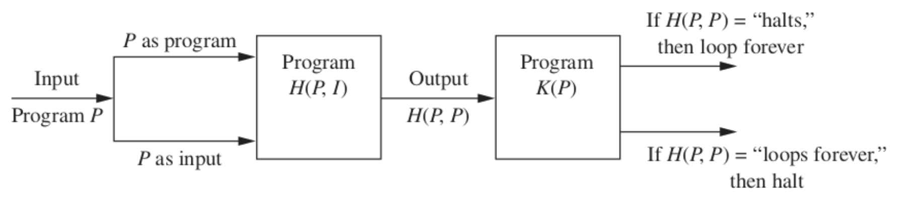

# Growth of Functions and Algorithms

Edited by DeepSeek-R1

---

## Introduction to Algorithms

- **Definition**:  
  A finite sequence of precise instructions for performing a computation or solving a problem.
- **Origin**:  
  Derived from the name of Persian mathematician **al-Khwarizmi**.

---

## Example: Finding Maximum Value in a Sequence

**Problem**:  
Describe an algorithm to find the largest integer in a finite sequence.

**Solution Steps**:
1. Set temporary maximum = first integer.
2. Compare next integer to temporary maximum:
   - If larger, update temporary maximum.
3. Repeat Step 2 for all integers.
4. Stop when sequence ends. The temporary maximum is the result.

---

## Properties of Algorithms

An algorithm must have:
- **Input**: Values from a specified set.
- **Output**: Solution from a specified set.
- **Definiteness**: Precise, unambiguous steps.
- **Correctness**: Produces the right output.
- **Finiteness**: Terminates after finite steps.
- **Effectiveness**: Each step is executable.
- **Generality**: Applicable to all relevant inputs.

---

## Proving Properties for the Maximum-Finding Algorithm

- **Input**: Sequence of integers.
- **Output**: Largest integer.
- **Definiteness**: Each step is clear (e.g., "compare next integer").
- **Correctness**: Correctly identifies the maximum through comparisons.
- **Finiteness**: Terminates after checking all elements.
- **Effectiveness**: Comparisons and updates are executable.
- **Generality**: Works for any finite integer sequence.

---

## Searching Algorithms

- linear search
- binary search

---

## Sorting Algorithms

- Buble Sort
- Insertion Sort

---

## Greedy Algorithms
- **optimization problems.**
The goal of such problems is to find a solution to the given problem that either minimizes or maximizes the value of some parameter.

- **Purpose**: Solve optimization problems (minimize/maximize a parameter).

---

## Greedy Algorithms
- **Purpose**: Solve optimization problems (minimize/maximize a parameter).
- **Approach**:  
  Select the **locally optimal choice** at each step.
- **Example (Coin Change)**:  
  Use the fewest coins possible (e.g., 25¢ > 10¢ > 5¢ > 1¢).
- **Limitation**:  
  Not always optimal for all systems (e.g., non-canonical coin values).

---


## The Halting Problem

**Question**:  
Can a procedure determine if a program `P` with input `I` will halt?

**Answer**:  
No. The halting problem is **unsolvable**.

---


**Proof by Contradiction**:
1. Assume a solution `H(P, I)` exists.
2. Construct a program `K(P)` that:
   - Halts if `H(P, P)` says "loops forever."
   - Loops forever if `H(P, P)` says "halt."
3. Feeding `K` into itself leads to a contradiction.  
   ∴ No such `H` can exist.

---


*Taken from textbook: figure-2*

---

## Growth of Functions
Consider function $f(x)=x^2+2x+1$

The growth of functions is often described using **asymptotic notations**. 
- a tool for describing the behavior of functions on large values
- used in the analysis of algorithms

---

## Asymptotic Notations: Big-O

**Definition**:  
`f(n) = O(g(n))` if ∃ constants `c > 0`, `n₀ > 0` such that  
`|f(n)| ≤ c|g(n)|` for all `n > n₀`.

---

**Example**:  
Prove `n = O(n³)`:
- Choose `c = 1`, `n₀ = 1`.  
  For `n > 1`, `n ≤ n³`.

**Key Use**:  
Hides machine-dependent constants and focuses on growth rates.

---

**Example**:  
Prove/disprove `n³ = O(n)`:

---

for all c > 0 and n0, there exists some n > n0 for which $n^3$ is not less than c|n|.
- $n > n_0$ for which $n^3 > cn$
  - $n > c^{1/2}$;
  - setting $n > max(n0, c^{1/2})$ finishes the proof.

---

**Example**: 
Prove If f1(n) is in O(g(n)) and f2(n)  is in O(g(n)), 
then f1(n) + f2(n)  is in O(g(n)).

---

**Example**: 
Let $f(x) = a_n x^n + a_{n-1} x^{n-1}  + · · · +a_1 x + a_0$ , where a0 , a1 , . . . , an are real numbers. 
Then `f(x)` is $O(x^n)$.

Prove: Use triangle inequality in
$|f(x)| = x^n |a_n  + a_{n-1} 1/x  + · · · +a_1 1/x_{n-1} + a_01/x_{n}|$

---


## Big-Ω and Big-Θ

**Big-Ω (Lower Bound)**:  
`f(n) = Ω(g(n))` if ∃ `c > 0`, `n₀ > 0` such that  
`|f(n)| ≥ c|g(n)|` for all `n > n₀`.

---

**Big-Θ (Tight Bound)**:  
`f(n) = Θ(g(n))` if `f(n) = O(g(n))` **and** `f(n) = Ω(g(n))`.

**Example**:  
Polynomial `f(x) = aₙxⁿ + ... + a₀` is `Θ(xⁿ)`.

---

## Algorithmic Complexity

**Time Complexity**:  
Number of operations for an input of size `n`.

**Worst-Case Analysis**:  
Maximum operations needed for *any* input of size `n`.

**Tractable vs. Intractable**:
- **Tractable**: Solvable in polynomial time (`O(nᵏ)`).
- **Intractable**: Requires non-polynomial time (e.g., exponential).

---

## Matrix Chain Multiplication Example

**Problem**:  
Multiply matrices `A₁ (30×20)`, `A₂ (20×40)`, `A₃ (40×10)` with minimal multiplications.

**Optimal Order**:
- `(A₁A₂)A₃`: `30×20×40 + 30×40×10 = 24,000 + 12,000 = 36,000` multiplications.
- `A₁(A₂A₃)`: `20×40×10 + 30×20×10 = 8,000 + 6,000 = 14,000` multiplications.  
∴ **Optimal order is `A₁(A₂A₃)`**.

---

## Algorithmic Paradigms

**Brute-Force**:  
Solve directly using problem definitions (no optimization).

**Tractable Problems**:  
Solvable in polynomial time (e.g., sorting).

**Intractable/Unsolvable Problems**:  
- **Intractable**: No polynomial-time solution (e.g., TSP).
- **Unsolvable**: No algorithm exists (e.g., halting problem).

---

## Proving Algorithm Correctness: Induction & Loop Invariants

---

## Mathematical Induction

**Purpose**:  
Prove statements about algorithms that involve integer sequences or iterative processes.

**Steps**:
1. **Base Case**: Verify the statement for the initial value (e.g., `n = 1`).
2. **Inductive Hypothesis**: Assume the statement holds for `n = k`.
3. **Inductive Step**: Prove the statement for `n = k + 1` using the hypothesis.

---

### Induction Example: Maximum-Finding Algorithm

**Claim**:  
The algorithm correctly identifies the maximum in a sequence of integers.

**Proof**:
1. **Base Case**:  
   For a sequence of 1 integer, the temporary maximum is the only element. ✔️
2. **Inductive Hypothesis**:  
   Assume the algorithm works for sequences of length `k`.
3. **Inductive Step**:  
   For a sequence of length `k + 1`:
   - By hypothesis, the first `k` elements have a correct temporary max.
   - The `(k+1)`-th element is compared to this max and updates if larger.  
   ∴ The result is correct for `k + 1`.

---

## Loop Invariants

**Definition**:  
A condition that holds:
1. **Before the loop** (initialization),
2. **After each iteration** (maintenance),
3. **After termination** (correctness).

**Goal**:  
Use the invariant to prove the loop behaves as intended.

---

### Loop Invariant Example: Maximum-Finding Algorithm

**Invariant**:  
At the start of each iteration, the temporary maximum is the largest value seen so far.

**Proof**:
1. **Initialization**:  
   Before the loop, the temporary max is the first element (trivially the largest). ✔️
2. **Maintenance**:  
   Each iteration compares the next element to the temporary max and updates it if needed.  
   ⇒ The invariant holds after each iteration. ✔️
3. **Termination**:  
   When the loop ends, the temporary max has been compared to **all** elements.  
   ⇒ It is the true maximum. ✔️

---

## Why Use These Methods?

- **Induction**:  
  Formalizes correctness for recursive or iterative algorithms.
- **Loop Invariants**:  
  Provides a structured way to reason about loops.
- **Applications**:  
  Essential for verifying sorting, searching, and optimization algorithms.

---

## Summary

| **Method**       | **Key Steps**                          | **Use Case**              |
|-------------------|----------------------------------------|---------------------------|
| **Induction**     | Base case → Hypothesis → Inductive step | Proving algorithm works for all input sizes |
| **Loop Invariant**| Initialization → Maintenance → Termination | Verifying loop correctness | 


# Program Correctness (Based on Rosen’s Discrete Math)

---

## Key Concepts

**Program Correctness**:  
Proving that a program produces the correct output for all valid inputs.

**Two Components**:
1. **Partial Correctness**:  
   If the program terminates, it produces the correct result.
2. **Total Correctness**:  
   The program **always terminates** and produces the correct result.

---

## Preconditions and Postconditions

- **Precondition**:  
  A statement about the input that must be true **before** the program executes.  
  *Example*: `n ≥ 0` for a factorial program.

- **Postcondition**:  
  A statement about the output that must be true **after** the program executes.  
  *Example*: `result = n!` for a factorial program.

---

## Loop Invariants and Correctness

**Loop Invariant**:  
A condition that is true **before each iteration** of a loop. Used to prove partial correctness.

**Steps to Prove**:
1. **Initialization**: The invariant holds before the first iteration.
2. **Maintenance**: If the invariant holds before an iteration, it holds after.
3. **Termination**: The invariant + loop exit condition ⇒ postcondition.

---

### Example: Sum of First `n` Integers

**Precondition**: `n ≥ 0`  
**Postcondition**: `sum = 1 + 2 + ... + n`  
**Loop Invariant**:  
`sum = 1 + 2 + ... + k` and `k ≤ n` (where `k` is the loop counter).

**Proof**:
1. **Initialization**: `k = 0`, `sum = 0`. Invariant holds (trivially).
2. **Maintenance**: Each iteration increments `k` and adds `k` to `sum`. Invariant preserved.
3. **Termination**: When `k = n`, `sum = 1 + 2 + ... + n`. ✔️

---

## Partial vs. Total Correctness

| **Aspect**          | **Partial Correctness**                  | **Total Correctness**                  |
|----------------------|------------------------------------------|----------------------------------------|
| **Focus**            | Correctness **if** the program terminates | Correctness **and** termination       |
| **Requires Proof of**| Loop invariants + postcondition          | Loop invariants + termination condition |

---

## Termination Proofs

**Goal**: Show the loop **always** terminates.

**Strategies**:
- Use a **decreasing sequence** of integers (e.g., loop counter `i` decrements to 0).
- Ensure progress toward the exit condition in each iteration.

**Example**:  
```python
i = n
while i > 0:
    i = i - 1
```
**Termination**: `i` decreases by 1 each iteration; it will eventually reach 0.

---

## The Role of Induction

**Mathematical Induction** is used to formally verify loop invariants:
1. **Base Case**: Verify the invariant holds initially.
2. **Inductive Step**: Assume it holds for iteration `k`, prove for `k+1`.

**Example**:  
For the sum-of-integers algorithm, induction proves the invariant `sum = 1 + 2 + ... + k` holds for all `k ≤ n`.

---

## Summary (Rosen’s Approach)

1. **Specify preconditions and postconditions**.
2. **Identify loop invariants** for iterative algorithms.
3. **Prove partial correctness** using initialization, maintenance, termination.
4. **Prove termination** to establish total correctness.
5. **Use induction** to formalize invariant proofs.

---

## Common Pitfalls

- **Weak invariants**: Invariants that don’t fully capture the loop’s progress.
- **Ignoring edge cases**: Failing to test preconditions like `n = 0` or empty input.
- **Assuming termination**: Forgetting to prove loops eventually exit.
