# Discrete Probability

## Introduction to Discrete Probability
- **Probability Theory**: Fundamental framework for analyzing random phenomena.
- **Bayes’ Theorem**: Tool for updating probabilities based on new evidence.
- **Expected Value and Variance**: Measures of central tendency and spread in random outcomes.

---

## The Probability of Complements and Unions of Events
- **Key Concepts**:
  - Probability of event complement: $P(\overline{E}) = 1 - P(E)$
  - Union of events: $P(E \cup F) = P(E) + P(F) - P(E \cap F)$

---

## Probabilistic Reasoning

### The Monty Hall Three-Door Puzzle
- **Scenario**:
  - A prize is behind one of three doors.
  - After selecting a door, the host reveals a losing door from the remaining two.
  - **Choice**: Stick with the original door or switch?

---

- **Analysis**:
  - Initial probability of correct choice: $\frac{1}{3}$.
  - Probability initial choice is wrong: $\frac{2}{3}$.
  - Switching doors after a losing door is revealed increases winning probability to $\frac{2}{3}$.

---

## Probability Theory (Section 7.2)
- **Core Topics**:
  - Assigning Probabilities
  - Conditional Probability & Independence
  - Bernoulli Trials & Binomial Distribution
  - Random Variables
  - The Birthday Problem
  - Monte Carlo Algorithms

---

### Assigning Probabilities
- **Requirements**:  Probability Axioms
  1. **Non-Negativity**: $0 \leq p(s) \leq 1$ for all outcomes $s$.
  2. **Normalization**: $\sum_{s \in S} p(s) = 1$.
  3. **Additivity**: $P(A \cup B) = P(A) + P(B)$

---

- **Probability Distribution**: Function $p$ mapping outcomes in sample space $S$ to probabilities.

---

#### Example: Biased Coin
- **Problem**: A coin is biased such that Heads (H) occurs twice as often as Tails (T). Assign probabilities.

---

- **Solution**:
  - Let $p(T) = x$. Then $p(H) = 2x$.
  - Total probability: $2x + x = 3x = 1 \Rightarrow x = \frac{1}{3}$.
  - Thus, $p(H) = \frac{2}{3}, \; p(T) = \frac{1}{3}$.

---

#### Uniform Distribution
- **Definition**: For sample space $S$ with $n$ elements, each outcome has probability $\frac{1}{n}$.
- **Example**: Fair coin flip: $p(H) = p(T) = \frac{1}{2}$.

---

### Probability of an Event
- **Definition**: Probability of event $E$ is $p(E) = \sum_{s \in E} p(s)$.

---

#### Example: Biased Die
- **Problem**: A die is biased so 3 appears twice as often as other numbers. What is the probability of rolling an odd number?

---

- **Solution**:
  - Let probabilities of 1, 2, 4, 5, 6 be $x$. Then $p(3) = 2x$.
  - Total probability: $5x + 2x = 7x = 1 \Rightarrow x = \frac{1}{7}$.
  - Event $E = \{1, 3, 5\}$: $p(E) = \frac{1}{7} + \frac{2}{7} + \frac{1}{7} = \frac{4}{7}$.

---

## Probabilities of Complements and Unions of Events 🧩

 **Key Theorems**
 - 🎯**Complement Probability:**
```math 
P(E') = 1 - P(E) 
```
  
- 🎯**Union Probability:**  
```math 
P(E_1 \cup E_2) = P(E_1) + P(E_2) - P(E_1 \cap E_2)
```


---

## Finite Probability 🎲

### Core Concepts
✨ **Experiment**: Procedure with defined outcomes (e.g., rolling a die).  
✨ **Sample Space ($S$)**: Set of all possible outcomes.  
✨ **Event**: Subset of $S$ (e.g., rolling an odd number).  

---

**Pierre-Simon Laplace's Definition**
- For equally likely outcomes in finite $S$: 
```math 
P(E) = \frac{|E|}{|S|} 
```


---

### Examples & Solutions

#### 🎱 Urn Example
**Problem**: 4 blue + 5 red balls. Probability of drawing blue?  

---

**Solution**:  
$|S| = 9, \; |E| = 4 \quad \Rightarrow \quad P(E) = \frac{4}{9}$

---

#### 🎲 Dice Example
**Problem**: Probability two dice sum to 7.  

---

**Solution**:  
- Total outcomes: $6^2 = 36$  
- Favorable outcomes: $\{(1,6), (2,5), (3,4), (4,3), (5,2), (6,1)\}$  
$\Rightarrow P = \frac{6}{36} = \frac{1}{6}$

---

#### 🏆 Lottery Examples
**4-Digit Lottery**:  
- Total combinations: $10^4 = 10,\!000$  
- Win probability: $\frac{1}{10,\!000} = 0.0001$  

---

**Small Prize (3 digits matched)**:  
- Incorrect digit choices: $4 \times 9 = 36$  
- Probability: $\frac{36}{10,\!000} = 0.0036$

---

**6-Number Lottery (1–40)**:  
- Combinations: $\displaystyle \binom{40}{6} = 3,\!838,\!380$  
- Win probability: $\approx 0.00000026$

---

#### 📦 Balls from Bin
**Problem**: Probability of drawing 11, 4, 17, 39, 23 in order:  
- **a) Without replacement**:  
  $\displaystyle P = \frac{1}{50 \times 49 \times 48 \times 47 \times 46} = \frac{1}{254,\!251,\!200}$  

- **b) With replacement**:  
  $\displaystyle P = \frac{1}{50^5} = \frac{1}{312,\!500,\!000}$

---

### Summary: Probability Rules

**Complement:** 
```math
P(E') = 1 - P(E)
```
**Union:** 
```math
P(E1 \cup E2) = P(E1) + P(E2) - P(E1 \cap E2)
```
**Laplace:** 
```math 
P(E) = |E| / |S|
```


---

## Conditional Probability (Koşullu Olasılık) 🔄
 **Definition:**   
  For events $E$ and $F$ where $P(F) > 0$:  
```math
P(E|F) = \frac{P(E \cap F)}{P(F)}
```

---

### Examples & Solutions

#### 💻 Bit String Example
**Problem**: Probability a 4-bit string has ≥2 consecutive 0s <u>given the first bit is 0</u>.  

---

**Solution**:
- **Event $F$**: First bit = 0 ⇒ $|F| = 8$, $P(F) = \frac{1}{2}$.
- **Event $E \cap F$**: Strings with ≥2 consecutive 0s in $F$: {0000, 0001, 0010, 0011, 0100} ⇒ $|E \cap F| = 5$.
- **Result**: $\displaystyle P(E|F) = \frac{5/16}{1/2} = \frac{5}{8}$.

---

#### 👨👩👧 Family Example
**Problem**: Probability a family has two boys <u>given at least one boy</u>.  

---

**Solution**:
- **Event $F$**: At least one boy ⇒ $P(F) = \frac{3}{4}$.
- **Event $E \cap F$**: Two boys ⇒ $P(E \cap F) = \frac{1}{4}$.
- **Result**: $\displaystyle P(E|F) = \frac{1/4}{3/4} = \frac{1}{3}$.

---

## Independence (Bağımsızlık) 🔗

### Definition

Events $E$ and $F$ are independent if:
```math P(E \cap F) = P(E) \cdot P(F) ```

---


### Examples & Solutions

#### 💡 Bit String Independence Check
**Problem**: Are "starts with 1" and "has even 1s" independent?  

---

**Analysis**:
- $P(E) = \frac{1}{2}$, $P(F) = \frac{1}{2}$.
- $P(E \cap F) = \frac{4}{16} = \frac{1}{4}$.
- **Verification**: $\frac{1}{4} = \frac{1}{2} \times \frac{1}{2}$ ✅ ⇒ **Independent**.

---

#### 👪 Family Independence Check
**Problem**: Are "two boys" and "at least one boy" independent?  

---

**Analysis**:
- $P(E) = \frac{1}{4}$, $P(F) = \frac{3}{4}$.
- $P(E \cap F) = \frac{1}{4}$.
- **Verification**: $\frac{1}{4} \neq \frac{1}{4} \times \frac{3}{4}$ ❌ ⇒ **Not Independent**.

---

### Pairwise vs. Mutual Independence 🔄

```mermaid
graph LR
  A[Independence Types] --> B[Pairwise]
  A --> C[Mutual]
  B -->|Requires| D["P(E_i ∩ E_j) = P(E_i)P(E_j) ∀ pairs"]
  C -->|Requires| E["P(E_{i1} ∩ ... ∩ E_{im}) = P(E_{i1})...P(E_{im}) ∀ subsets"]
```



---

**Key Definitions**:
- **Pairwise Independence**: Independence for every pair of events.
- **Mutual Independence**: Independence for **all possible combinations** of events.

---

## Bernoulli Trials & Binomial Distribution 🎯

**Bernoulli Trial**:  
◾ Experiment with **two outcomes**: Success (S) with probability $p$, Failure (F) with $q = 1-p$.

**Binomial Theorem**:  
Probability of exactly $k$ successes in $n$ trials:  
```math
b(k; n, p) = \binom{n}{k} p^k q^{n-k}
```

---

### Example: Biased Coin Flips
**Problem**: Probability of 4 Heads in 7 flips of a coin where $P(H) = \frac{2}{3}$.  

---

**Solution**:  
```math
\begin{aligned}
\binom{7}{4} &= 35, \\
P(4\text{ Heads}) &= 35 \times \left(\frac{2}{3}\right)^4 \left(\frac{1}{3}\right)^3 \\
&= \frac{560}{2187} \approx 0.256.
\end{aligned}
```

---

## Random Variables 📉

**Definition**:  
◾ Function mapping sample space outcomes to real numbers.  
◾ **Distribution**: Set of pairs $(r, P(X=r))$.

---

### Example: Coin Flip Count
**Scenario**: Fair coin flipped 3 times. Let $X$ = number of heads.  

---

**Sample Space**:  
```math
S = \{HHH, HHT, HTH, THH, HTT, THT, TTH, TTT\}
```

---

**Random Variable Mapping**:  
| Outcome | $X$ (Number of Heads) |
|---------|---------------------------|
| HHH     | 3                         |
| HHT, HTH, THH | 2                  |
| HTT, THT, TTH | 1                  |
| TTT     | 0                         |

**Distribution**:  
```math
\left\{(3, \frac{1}{8}), (2, \frac{3}{8}), (1, \frac{3}{8}), (0, \frac{1}{8}\right\}
```

---

### Visualizing Binomial Distribution


**Key Takeaway**:  
◾ Binomial distribution quantifies success likelihood in repeated independent trials.  
◾ Random variables translate outcomes into measurable numerical values.


---

## Expected Value 📊

**Definition**:  
◾ Expected value of random variable $X$:  
```math
E(X) = \sum_{s \in S} p(s)X(s) \quad \text{or} \quad E(X) = \sum_{r} P(X=r) \cdot r
```

---

### Example: Dice Sum 🎲
**Problem**: Expected sum of two fair dice.  

---

**Solution**:  
| Sum ($r$) | 2   | 3   | 4   | 5   | 6   | 7   | 8   | 9   | 10  | 11  | 12  |
|---------------|-----|-----|-----|-----|-----|-----|-----|-----|-----|-----|-----|
| $P(X=r)$  | 1/36| 2/36| 3/36| 4/36| 5/36| 6/36| 5/36| 4/36| 3/36| 2/36| 1/36|  

```math
E(X) = \frac{2 + 6 + 12 + 20 + 30 + 42 + 40 + 36 + 30 + 22 + 12}{36} = 7
```

---

### Linearity of Expectations 🔗
**Theorem**: For random variables $X_1, X_2, \dots, X_n$:  
1. $E(X_1 + \dots + X_n) = E(X_1) + \dots + E(X_n)$  
2. $E(aX + b) = aE(X) + b$  

---

### Hatcheck Problem 🎩
**Problem**: Expected number of correct hat returns for $n$ people.  

---

**Solution**:  
- Let $X_i = 1$ if person $i$ gets correct hat, else $0$.  
- $E(X_i) = \frac{1}{n}$ for all $i$.  
- $E(X) = \sum_{i=1}^n \frac{1}{n} = 1$.  

```mermaid
graph LR
  A[Hatcheck] --> B["X = X₁ + ... + Xₙ"]
  B --> C["E(X) = E(X₁) + ... + E(Xₙ)"]
  C --> D["Each E(Xᵢ) = 1/n"]
  D --> E["Total E(X) = 1"]
```



---

## The Birthday Problem 🎂

**Question**: Minimum $n$ people for >50% shared birthday probability.  

---

**Solution**:  
```math
p_n = \frac{365}{365} \times \frac{364}{365} \times \dots \times \frac{365-n+1}{365}
```
- **For $n=23$**:
  ```math
  1 - p_{23} \approx 1 - 0.494 = 0.506
  ```
**Conclusion**: Only 23 people needed!

---

## Hashing Collisions 💻

**Problem**: Probability of no collisions for $n$ keys in $m$ locations.  

**Formula**:  
```math
p_n = \frac{m}{m} \times \frac{m-1}{m} \times \dots \times \frac{m-n+1}{m}
```

---

**Example**:  
- For $m = 365,\!000,\!000$:  
- Smallest $n$ with collision probability >50%: **≈1178**.  


**Key Insight**: Both problems use **combinatorial probability decay**!  

---

## Bayes’ Theorem 🧠

**Motivation**: Update probabilities using new evidence (e.g., medical testing, AI decisions).

---

### Theorem & Derivation
```math
P(F|E) = \frac{P(E|F)P(F)}{P(E)}
```
**Derivation Steps**:  
1. $P(F|E) = \frac{P(F \cap E)}{P(E)}$  
2. $P(E|F) = \frac{P(E \cap F)}{P(F)} \Rightarrow P(E \cap F) = P(E|F)P(F)$  
3. Substitute into step 1: **Bayes' Formula**.

---

### Expanded Forms
**Total Probability**:  
```math
P(E) = P(E|F)P(F) + P(E|F')P(F')
```
**Generalized Form** (for partitions $F_1, ..., F_n$):  
```math
P(F_j|E) = \frac{P(E|F_j)P(F_j)}{\sum_{i=1}^n P(E|F_i)P(F_i)}
```

---

### Example 1: Two Boxes 🎁
**Scenario**:  
- **Box 1**: 2 green, 7 red balls  
- **Box 2**: 4 green, 3 red balls  
- Randomly pick a box → draw a red ball. Probability it’s Box 1?  

---

**Solution**:  
```math
\begin{aligned}
P(B_1|R) &= \frac{P(R|B_1)P(B_1)}{P(R)} \\
P(R) &= \frac{7}{9} \cdot \frac{1}{2} + \frac{3}{7} \cdot \frac{1}{2} = \frac{38}{63} \\
P(B_1|R) &= \frac{\frac{7}{18}}{\frac{38}{63}} = \frac{49}{76} \approx 0.6447
\end{aligned}
```

---

### Example 2: Disease Testing 🧪
**Data**:  
- Prevalence: $P(F) = 0.00001$  
- Test Accuracy:  
  - $P(E|F) = 0.99$ (true positive)  
  - $P(E'|F') = 0.995$ (true negative)  

---

**Q1**: Probability of disease if test positive?  
```math
P(F|E) = \frac{0.99 \times 0.00001}{0.99 \times 0.00001 + 0.005 \times 0.99999} \approx 0.1976\%
```

---

**Q2**: Probability healthy if test negative?  
```math
P(F'|E') = \frac{0.995 \times 0.99999}{0.995 \times 0.99999 + 0.01 \times 0.00001} \approx 99.99999\%
```

---


**Key Insight**:  
◾ Rare diseases → Even accurate tests yield many false positives.  
◾ Always consider base rates in Bayesian reasoning!  


---


### Bayesian Applications in Spam Filters & AI 📧🤖

---

#### **1. Spam Filters 🛡️**
**How It Works**:  
- **Training Phase**:  
  - Analyze a corpus of emails labeled as "spam" or "ham" (non-spam).  
  - Calculate probabilities for words (e.g., "free," "offer," "credit") appearing in spam vs. ham.  

---

- **Classification**:  
  - For a new email, compute the probability it’s spam using Bayes’ Theorem:  
    ```math
    P(\text{Spam}|\text{Words}) = \frac{P(\text{Words}|\text{Spam})P(\text{Spam})}{P(\text{Words})}
    ```  
  - Words are treated as independent features (Naive Bayes assumption).  

---

**Example**:  
- If "free" appears in 80% of spam emails and 2% of ham emails:  
  - An email with "free" has a high posterior probability of being spam.  
  - Combine probabilities for all words to make the final classification.  

---

#### **2. AI: Medical Diagnosis 🏥**  
**Bayesian Networks**:  
- Model relationships between symptoms, diseases, and test results.  
- Update probabilities as new evidence arrives.  

---
**Example**:  
- **Nodes**:  
  - **Disease (D)**: Prior probability = 1% (rare).  
  - **Symptom (S)**: $P(S|D) = 90\%$, $ P(S|\neg D) = 5\%$.  
- **Calculation**:  
  ```math
  P(D|S) = \frac{0.9 \times 0.01}{0.9 \times 0.01 + 0.05 \times 0.99} \approx 15.4\%
  ```  
  Even with a symptom, the disease remains unlikely due to its rarity.  

---

#### **3. AI: Autonomous Vehicles 🚗**  
**Sensor Fusion**:  
- Use Bayesian filters (e.g., Kalman filters) to predict vehicle position.  
- Combine noisy sensor data (LIDAR, cameras) with prior motion models.  

**Example**:  
- **Prior**: Car is at position $ X$.  
- **Sensor Update**: New data suggests it’s at $ Y$.  
- **Posterior**: Bayes’ Theorem weights sensor reliability and prior confidence.  

---

#### **4. AI: Recommendation Systems 🎬**  
**Predictive Modeling**:  
- Estimate $P(\text{User Likes Movie}|\text{Genres, Ratings})$.  
- Update recommendations as user preferences evolve.  

**Example**:  
- If a user likes *Sci-Fi* ($P(\text{Sci-Fi}) = 70\%$) and *Action* ($P(\text{Action}) = 60\%$):  
  - A new *Sci-Fi/Action* movie has high $P(\text{Like})$.  

---

### Key Takeaway 🌟  
Bayesian methods thrive in **uncertainty-driven domains**:  
- **Adaptability**: Update beliefs with new data.  
- **Interpretability**: Quantify confidence in predictions.  
- **Efficiency**: Simplify complex dependencies (e.g., Naive Bayes).  


*Used in fraud detection, weather forecasting, and even Netflix’s "Top Picks"!*